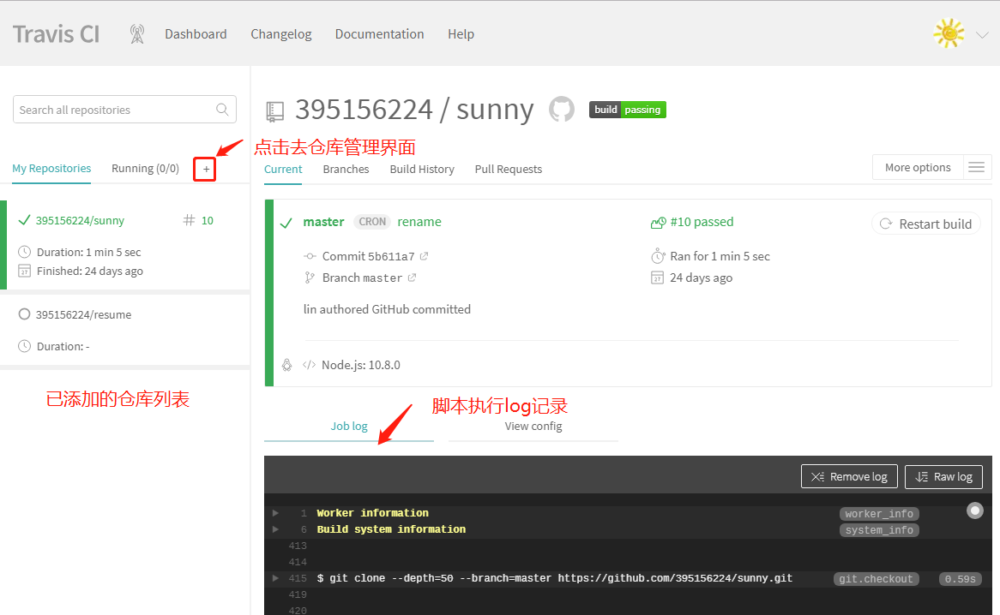
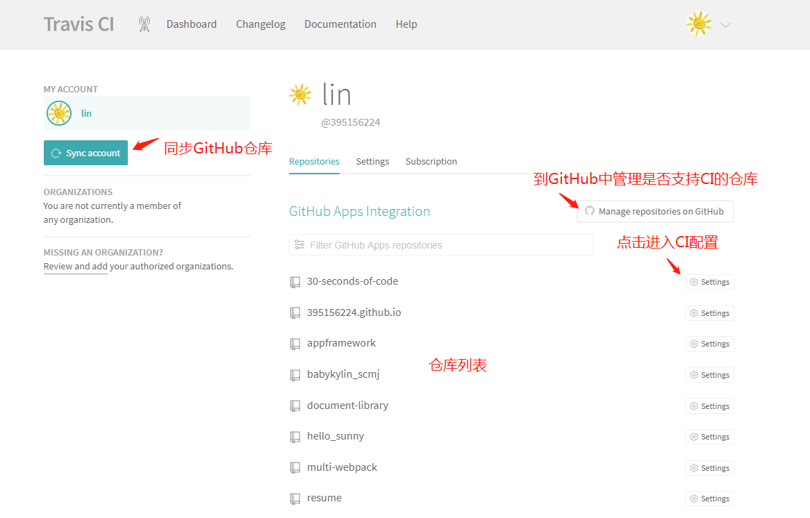
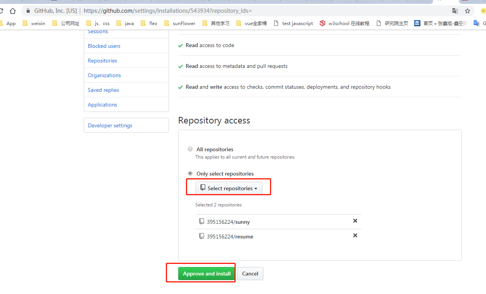
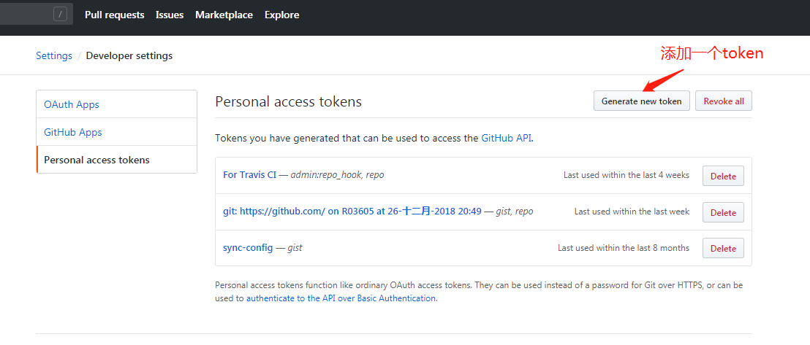
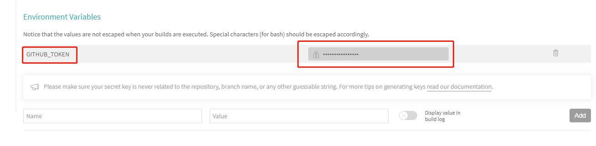

TravisCI
===
> Hi Sunny <br>
> create at **2019-01-22        ** <br>


&emsp;Travis CI 是目前新兴的开源持续集成构建项目，采用yaml格式配置，同时它是在线的服务，不需要你本地打架服务器，简洁清新独树一帜。目前大多数的github项目都已经移入到Travis CI的构建队列中，据说Travis CI每天运行超过4000次完整构建。对于做开源项目或者Github的使用者，如果你的项目还没有加入Travis CI构建队列，那真是out了。


# 我的主页
我的主页是使用VuePress来搭建的，托管到Github提供的Gitpage服务上。

当我更新个人笔记，git push到github，然后Travis自动构建，构建完成后自动推送到Gitpage服务上。

为了让个人主页的链接简洁点，形如：http://395156224.github.io/
，我把VuePress构建生成后的HTML文件和主页的源文件分开放在两个仓库。
`主页仓库地址`：https://github.com/395156224/395156224.github.io <br>
`源文件仓库地址`：https://github.com/395156224/sunny

395156224.github.io是静态文件库，也就是VuePress生成后的HTML文件，这样命名使用Git Page服务的访问地址比较简洁。

# 1、启用要构建的项目
首先如果你要使用Travis CI，你必须要GIthub账号（好像Travis CI只支持构建github的项目）

使用Github账号登录[Travis CI官网](https://travis-ci.com/)。
1. 点击My Repositories旁边的+，到Travis CI的仓库管理页面

（PS：图中看到我已经添加了我的主页的源文件库）
2. 点击“Manage repositories on GitHub”按钮，跳转到到[Github](https://github.com/settings/installations/543934?repository_ids=)，添加要管理的仓库

3. 跳转到GitHub上添加支持TravisCI并应用

应用后页面会跳转到上图步骤2的Travis CI的仓库管理页面，看到添加了的仓库。
<br>

# 2、在Travis CI配置Github的Access Token
1. 到[GitHub](https://github.com/settings/tokens)的设置界面（具体路径在Setting -> Developer Setting -> Personal access tokensyemian ），点击右上角的Generate new token按钮会重新生成一个token（取个名字，下面是勾选一些权限）。

生成后，拷贝下来，只有这时候他才显示，为了安全下次进入就不会显示了，如果忘了只能重新生成一个了，拷贝完以后我们需要到Travis CI网站配置下。

2.点击对应仓库的“setting”界面,在Environment Variables里添加一个环境变量


# 3、在源代码的仓库根目录中创建一个.travis.yml的配置文件
内容如下：
```
language: node_js
node_js:
  - "10.8.0"

env:
 global:
   - GH_REF: github.com/395156224/sunny.git
   - IO_REF: github.com/395156224/395156224.github.io.git

cache:
  yarn: true
  directories:
    - /node_modules/

deploy:
  provider: pages
  skip-cleanup: true
  github-token: $GITHUB_TOKEN
  keep-history: true
  on:
    branch: master

before_install:

install:

before_script:

script:
  - yarn build

after_script:
  # 导航到构建输出目录
  - cd docs/.vuepress/dist
  - git init
  - git add -A
  - git commit -m 'Update Sunny Home Pages by Travis CI'

  # 推到源文件仓库的的 gh-page 分支
  - git push --force --quiet  "https://${GITHUB_TOKEN}@${GH_REF}" master:gh-pages

  # 推到发布的 .io 分支
  - git push --force --quiet  "https://${GITHUB_TOKEN}@${IO_REF}" master:master
```

# 4、提交代码/文章到源文件仓库
提交会触发Travis CI根据yml脚本自动构建
